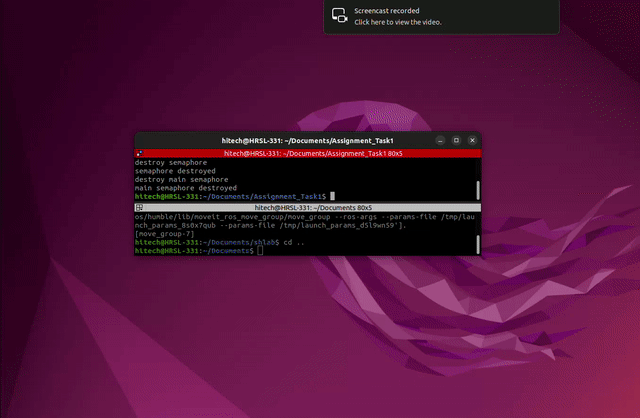

# Task 1: Autonomous Pick and Place



This folder contains an autonomous pick-and-place pipeline implemented in **PyBullet** for the **Franka Emika Panda** robot. The primary objective of this task is to demonstrate accurate object detection, projection of 2D pixel coordinates into a 3D world space, and the execution of a robust pick-and-place sequence using Inverse Kinematics (IK).

## Project Overview

*   **Simulation Environment**: Uses PyBullet to simulate physics, collision detection, and robotic kinematics. Features a custom table and the random generation of target objects (blocks).
*   **Perception & Vision**: Integrates a simulated multi-camera system (an overhead camera and a wrist-mounted camera). The system performs 3D Back-Projection to convert 2D pixel coordinates from the camera sensors into absolute 3D world coordinates that the robot can reach.
*   **Motor Control & Planning**: 
    *   Uses PyBullet's built-in Inverse Kinematics solver (`calculateInverseKinematics`) to determine required joint angles.
    *   Implements a State-Machine grasp pipeline: **Approach -> Descend -> Grasp -> Lift -> Place**.

## Technical Implementation

The most critical component of this project is the **Back-Projection algorithm**, which relies on the camera intrinsic matrix ($K$) and extrinsic transformation matrix ($T_{camera\_world}$).

It calculates the target object's position by solving the transformation:
$$P_{world} = T_{camera\_world} \cdot K^{-1} \cdot P_{pixel} \cdot d$$

This allows the robot to "see" a 2D image, calculate how far away the object is ($d$), and accurately position its gripper over the target.

## Setup & Execution

### Prerequisites
You need Python 3 installed with the following libraries:
```bash
pip install pybullet numpy
```

### Running the Code
Run the main script to start the PyBullet GUI. The robot will automatically detect the block on the table, calculate its position, grab it, and move it to a new location.
```bash
python3 main.py
```
